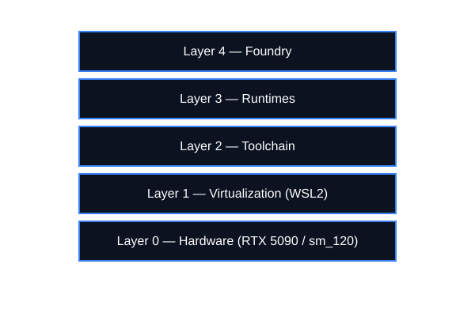
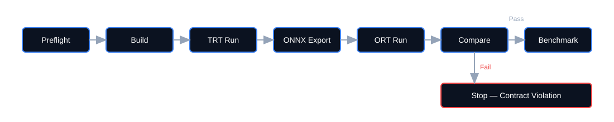

# Blackwell Citadel  
## Container-Free Blackwell-Native GPU ModelOps Foundry (WSL2)

Blackwell Citadel is a deterministic, container-free GPU ModelOps validation architecture targeting NVIDIA Blackwell (`sm_120`) under CUDA 13.x on Windows 11 with Ubuntu 24.04 (WSL2).

The system replaces opaque container inheritance with explicit toolchain governance, architecture-level CUDA targeting, and artifact-traceable validation.

This repository documents a validated Blackwell-native runtime surface.

---

# Architectural Thesis

Blackwell Citadel is founded on the principle that reproducibility in GPU infrastructure requires explicit control over toolchain, runtime, and execution boundaries.

The architecture enforces:

- Deterministic toolchain governance  
- Explicit CUDA architecture targeting (`sm_120`)  
- Runtime surface transparency  
- Contract-based correctness gating  
- Artifact-grade execution traceability  

Containerization optimizes portability.  
Citadel optimizes determinism.  

These objectives serve different engineering goals.

---

# Non-Goals

- This repository is not a container deployment demonstration.  
- This repository does not prioritize portability-first abstraction.  
- This repository does not claim cross-architecture generalization.  

Its objective is deterministic, Blackwell-native validation.

---

# Intended Audience

This repository is intended for:

- GPU infrastructure engineers  
- CUDA / TensorRT runtime developers  
- ModelOps and inference validation specialists  
- Engineers evaluating Blackwell-native execution surfaces  

---

# Blackwell-Specific Considerations

This stack was validated exclusively on NVIDIA Blackwell (`sm_120`) hardware under CUDA 13.1.

Blackwell introduces architectural and scheduling characteristics including:

- Updated Tensor Core execution behavior  
- Compiler surface interactions under `nvcc` 13.x  
- Myelin graph execution paths in TensorRT 10.15.x  
- Dynamic-shape scheduling nuances  

All validation and benchmark artifacts are hardware-bound to `sm_120`.  
No cross-architecture claims are made.

---

# 1. Architectural Overview

## Layered System Model

The Citadel is structured as a layered system where each layer is independently verifiable and replaceable. This reduces cross-layer coupling and isolates failure surfaces.



### Layer 4 – Foundry
Pipelines, artifacts, numerical parity enforcement, benchmark harnesses, execution dossiers.

### Layer 3 – Runtimes
PyTorch (source-built), ONNX Runtime, TensorRT, TensorRT-LLM.

### Layer 2 – Toolchain
CUDA 13.1, `nvcc`, GCC/G++, CMake, Ninja, Python 3.12 development stack.

### Layer 1 – Virtualization
WSL2 with `/dev/dxg` GPU pass-through.

### Layer 0 – Hardware
RTX 5090 Laptop GPU (Blackwell, `sm_120`).

---

## Explicit Runtime Surface

### Hardware

- **GPU:** NVIDIA RTX 5090 Laptop GPU (`sm_120`)  
- **Driver:** 591.74  
- **CUDA:** 13.1  

### Runtimes

- **TensorRT:** 10.15.1.29  
- **TensorRT-LLM:** 1.1.0  
- **ONNX Runtime:** CUDAExecutionProvider  
- **Torch:** 2.10.0 (source-built)  

All versions are explicitly captured per run and recorded in execution manifests.

---

# Repository Structure

```text
Blackwell-Citadel/
├── foundry/
├── trt_bench/
├── manifests/
├── evidence/
├── docs/
└── README.md
```

---

# Why No Containers?

Containers introduce abstraction layers that obscure:

- CUDA ABI alignment  
- `glibc` inheritance  
- Driver/runtime coupling  
- Execution context ownership  

Citadel intentionally removes these layers during baseline validation.

Container baselines will be introduced only after deterministic reference stability is established.

---

# 2. Deterministic Governance Model

Determinism is operationalized through explicit governance controls:


This baseline architecture intentionally excludes container abstraction in order to maintain full control over:

- Compiler versions  
- CUDA architecture targeting flags  
- Runtime binding behavior  
- Context ownership  
- Artifact traceability  

## Governance Controls

- No container abstraction in baseline phase  
- Explicit `CUDA_HOME` pinning and path governance  
- `update-alternatives` CUDA symlink control  
- Non-root operational separation  
- Artifact hashing (`sha256`) for engines and wheels  
- Version-surface capture per run (Python, CUDA, TensorRT, Torch, ORT, GPU driver)  

**Reproducibility is enforced, not assumed.**

---

## Reproducibility Contract

Each validated execution produces:

- Engine `sha256`
- Runtime version surface (CUDA, TensorRT, Torch, ORT)
- GPU identity (`nvidia-smi`)
- Driver version
- WSL kernel version
- Benchmark summary dossier (JSON)

No performance result is accepted without a matching manifest.

---

# 3. Foundry Execution Flow

The Foundry implements a deterministic, validation-first execution pipeline:



## Preflight Validates

- GPU visibility  
- CUDA toolchain alignment  
- Runtime version surface  

## Build Produces

- TensorRT engines  
- Timestamped artifacts  

## Compare Enforces

- Numerical contract compliance  

Benchmarking executes only after parity passes.

> **Parity is a gate.  
> Benchmarking is earned.**

---

# 4. Numerical Contract Enforcement

Numerical validation is treated as a formal contract.

## Validation Metrics

- `max_abs_diff`  
- `mean_abs_diff`  
- `p99_abs_diff`  
- `tolerance`  

Runs exceeding tolerance are marked as failures and do not proceed to performance claims.

---

## Example Recorded Failure (Fail-Fast Behavior)

| Metric        | Value                |
|--------------|----------------------|
| max_abs_diff | 0.15625              |
| mean_abs_diff| 0.014972329139709473 |
| p99_abs_diff | 0.0986328125         |
| tolerance    | 0.1                  |
| pass         | false                |

Failure is evidence of enforcement, not instability.

Subsequent passes were achieved after correcting execution context ownership and pipeline input consistency.

---

# 5. Benchmark Summary

Benchmarking was executed with warmup iterations followed by timed iterations. Percentile latency metrics (`p50`, `p90`, `p99`) and mean latency were recorded.

## Percentile Summary (Dynamic FP16 Engine)

| Shape       | TRT Version | p50 (ms) | p90 (ms) | p99 (ms) | Mean (ms) |
|------------|------------|----------|----------|----------|-----------|
| 512x512    | 10.15.1.29 | 0.0425   | 0.0490   | 0.0790   | 0.0443    |
| 1024x1024  | 10.15.1.29 | 0.0522   | 0.0663   | 0.0922   | 0.0552    |

## Mean Latency (Quick Bench Outputs)

- `n=512` → 0.0182 ms  
- `n=1024` → 0.0278 ms  
- `n=2048` → 0.1576 ms  

Results are reported without inflation or extrapolation.

---

# 6. Failure Mode Register (Condensed)

## FM-001 — CUDA Context Collision

**Symptom:**  
Myelin enqueue/execute failures when mixing Torch CUDA contexts with `pycuda.autoinit` or explicit `Device.make_context`.

**Mitigation:**  
Single-owner CUDA context policy; process-isolated TRT runs.

---

## FM-002 — ONNX Dimension Mismatch

**Symptom:**  
ONNXRuntime `INVALID_ARGUMENT` due to incorrect input dimensions during sweep benchmarking.

**Mitigation:**  
Enforce artifact shape contracts; guardrails in benchmark harness.

---

## FM-003 — TensorRT Teardown Instability

**Symptom:**  
Engine/context destruction errors leading to `free(): invalid pointer` or core dump.

**Mitigation:**  
Explicit stream synchronization; deterministic teardown ordering; process isolation.

Full classification and mitigation detail are provided in the white paper (`Blackwell_Citadel_White_Paper_v1.pdf`).

---

# 7. Artifact Integrity Policy

## Controls

- Wheel hashes captured during installation  
- TensorRT engine `sha256` recorded per build  
- Summary JSON execution dossier emitted per benchmark  
- Step logs hashed and indexed  
- Project file index with `sha256` verification  

Artifacts are treated as evidence, not byproducts.

---

# 8. Roadmap

- Enforce strict `CONTRACT_v1` schema gate across pipelines  
- Expand kernel validation coverage (FlashAttention, fused SDP, RMSNorm)  
- Standardize CUDA context ownership wrapper enforcement  
- Introduce container baseline only after deterministic baseline stabilization  

Containers will be introduced as a controlled comparison layer, not as a foundational dependency.

---

# Closing Position

Blackwell Citadel establishes a deterministic reference baseline for Blackwell-native runtime validation on `sm_120`.

It operationalizes explicit toolchain governance, contract-based correctness enforcement, structured failure classification, and audit-grade artifact traceability within a controlled execution model.

The repository stands as a documented, reproducible validation surface for Blackwell under CUDA 13.x.
